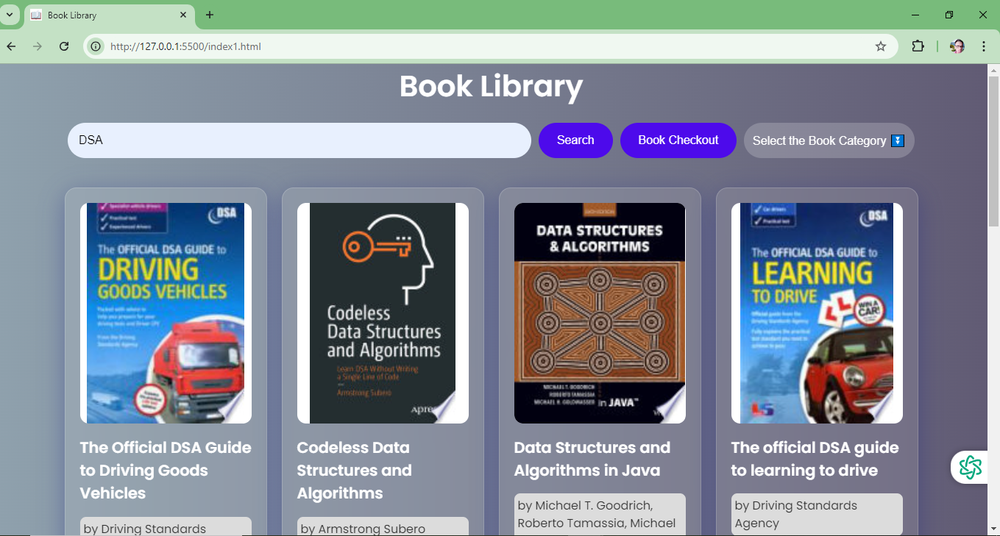
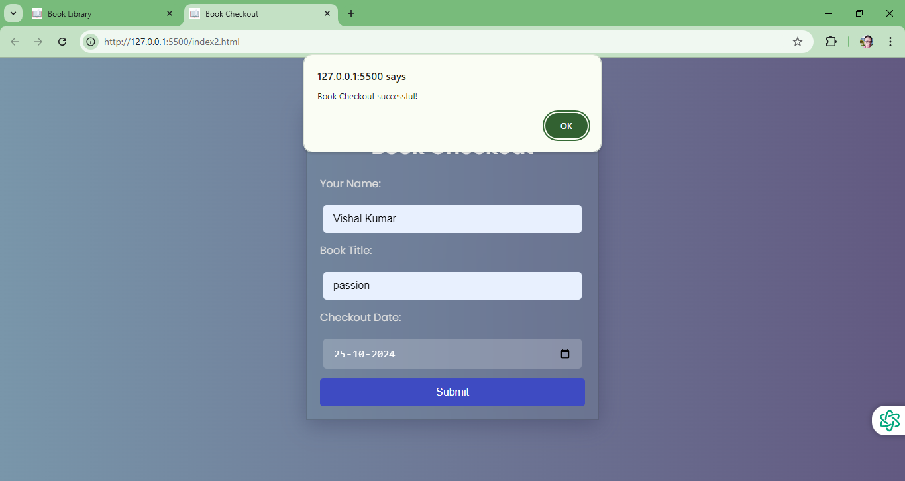

# 📚 Book Library Web Application

Welcome to the Book Library web app! This intuitive and responsive platform allows users to search for books, view detailed information, and record book checkouts effortlessly. Built with a clean design and smooth user experience in mind, this app integrates with the Google Books API, making it easy to discover and borrow books.

## 🚀 Demo

Check out the live demo here 👉: [Book Library Demo]()

## 🔑 Key Features

- **Book Search**: Search for books by title or keywords using the Google Books API.
- **Category Filter**: Filter search results by genres, such as Biography, Fiction, Science, and more.
- **Book Checkout Form**: Capture user details for book checkout, including name, book title, and checkout date.
- **Dynamic Book Display**: View book titles, authors, and cover images in real-time.
- **Responsive Design**: Enjoy a seamless experience on desktops, tablets, and mobile devices.
- **Error Handling**: Provides feedback if a search query fails or returns no results.

## 🛠️ Technologies Used

This project is crafted using modern web technologies to ensure a reliable and smooth user experience:

- **HTML5**: Structures the pages and organizes the input fields and search interface.
- **CSS**: Delivers a responsive and visually appealing layout across devices.
- **JavaScript**: Powers the dynamic search, API integration, and interactive elements on the pages.

## 🎯 Purpose & Motivation

The Book Library web app was created to offer users a streamlined and visually appealing platform for book discovery and management. With the goal of making book searching easy and checkout records straightforward, this app provides essential library features that are accessible from any device. The integration with the Google Books API makes it a valuable resource for anyone looking to explore a wide variety of books in real-time.

## 🧑‍💻 Usage Guide

- **Search for Books**: Enter a keyword or title in the search bar on the main page and click "Search." The app will retrieve relevant books and display their covers, titles, and authors.
- **Filter by Category**: Use the dropdown menu to select a book category, refining your search results.
- **Book Checkout**: On the checkout page, fill in your name, the book title, and the checkout date, then submit the form to record your checkout details.

## 🎨 Customization

This project is designed for easy customization. You can:

- **Modify Styles**: Update the `style1.css` and `style2.css` files to alter the layout, colors, or overall design.
- **Enhance Features**: Add functionality, such as checkout history, personalized recommendations, or user accounts, by extending the JavaScript files.
- **Add Categories**: Expand the categories dropdown with additional genres or refine the existing ones in `index.html`.

## 🔍 View of My Project: Book Library
- Book Library

- Book Checkout

## 📜 License

This project is licensed under the MIT License - see the [LICENSE](LICENSE) file for details.

## 🙏 Acknowledgements

Special thanks to:

- [Google Books API](https://developers.google.com/books) for enabling easy access to a vast collection of book data.
- [Google Fonts](https://fonts.google.com/) for providing beautiful and accessible fonts.
